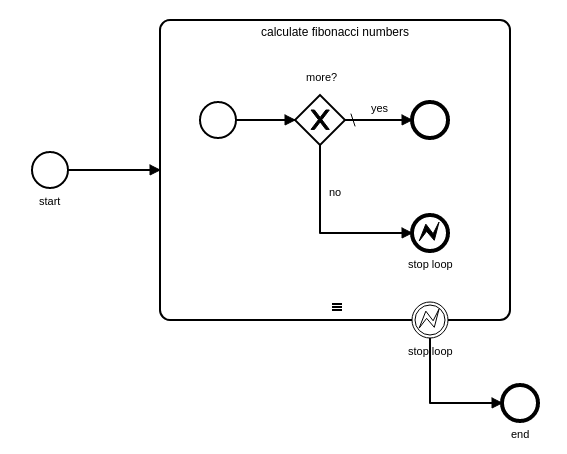

# Fibonacci

Using a BPMN to calculate Fibonacci numbers.

* no job workers - only FEEL expressions in variable mappings
* using a sequential multi-instance sub-process to calucate the numbers
* modify the list to iterate over while iterating in the output mapping of the sub-process
* the list is initialized using an output mapping on the start event

## Usage
* deploy the [workflow](fibonacci.bpmn) to a Zeebe broker (>= 0.23.0)
* create a new workflow instance with a numberic variable `x` that defines the amount of numbers to calculate
